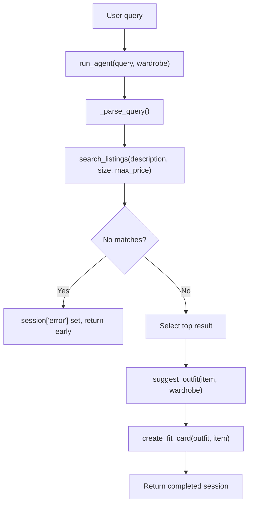

# Building FitFindr: A Small Agent That Turns Thrift Listings into Outfit Ideas

*How I designed a three-tool LLM agent that stays cheap, testable, and hard to break.*

---

## The problem

Secondhand shopping is great until you're staring at a single listing wondering, *"Okay… but what do I actually wear this with?"* The item is cute. Whether it fits your closet is a different question entirely.

FitFindr is my answer to that. You describe what you're after in plain English — *"vintage graphic tee under $30, size M"* — and it does three things:

1. **Finds** a matching secondhand listing.
2. **Styles** it against the clothes you already own.
3. **Writes** a shareable, OOTD-style caption for the find.

It's a small project, but it's a complete one: a natural-language query goes in, and a ready-to-post outfit card comes out. This post walks through how it's built, the decisions that shaped it, and the parts I'd do differently next time.

---

## The shape of the system

The whole thing is an orchestrated pipeline. One entry point, `run_agent(query, wardrobe)`, drives three tools in sequence and carries state between them in a single dictionary.



Three tools, each with a single job:

| Tool | Signature | What it does |
|------|-----------|--------------|
| `search_listings` | `(description, size?, max_price?) -> list[dict]` | Deterministic, offline keyword search over a local dataset |
| `suggest_outfit` | `(new_item, wardrobe) -> str` | LLM-backed styling against the user's closet |
| `create_fit_card` | `(outfit, new_item) -> str` | LLM-backed social caption generation |

The split matters. Only two of the three tools call an LLM, and the one that runs first — search — doesn't. That single design choice ripples through everything: cost, testability, and how the agent behaves when there's nothing to find.

---

## Decision 1: Don't use an LLM where a regex will do

The most tempting mistake in an "AI project" is to reach for the model on every step. Query parsing is the obvious candidate — *"vintage graphic tee under $30, size M"* clearly needs to be broken into a description, a size, and a budget. Why not just ask the model?

Because parsing this is a *solved* problem that doesn't need a 70-billion-parameter model, a network round trip, or a per-call cost. So `_parse_query()` is plain regex:

```python
# Only treat a number as a budget when it's tied to "$" or a price keyword,
# so a stray number in the description isn't mistaken for a budget.
price_phrase = re.search(
    r"(?:under|below|less than|max(?:\s*price)?|up to|<)\s*\$?\s*(\d+(?:\.\d+)?)"
    r"|\$\s*(\d+(?:\.\d+)?)",
    text,
    flags=re.IGNORECASE,
)
```

That regex encodes a real piece of product judgment: "size 8 boots" shouldn't read `8` as a $8 budget, so a number only counts as a price when it's anchored to a `$` or a phrase like *under* / *max* / *up to*. Sizes get similar care — bare `s`/`m`/`l` are too ambiguous to grab on their own, so those require an explicit `size M`, while `medium` is safe to match anywhere.

The payoff: parsing is instant, free, deterministic, and unit-testable without a network connection. **Use the LLM for the parts that genuinely need language understanding — styling and voice — and nothing else.**

---

## Decision 2: Make search deterministic and offline

`search_listings` scores every listing by keyword overlap against a local JSON dataset. No embeddings, no vector DB, no API:

```python
# Distinct keywords matched is the primary score; total occurrences
# break ties so a more on-topic listing ranks higher.
distinct = sum(1 for kw in set(keywords) if kw in haystack_set)
occurrences = sum(haystack.count(kw) for kw in keywords)
score = distinct * 1000 + occurrences
```

The `distinct * 1000 + occurrences` trick is a cheap way to get a two-level sort in a single integer: rank first by *how many* distinct query terms a listing matches, then break ties by *how often* they appear. A listing that hits three of your keywords always beats one that hits two, no matter how many times the loser repeats a word.

Filters run before scoring (price ceiling is inclusive; size matching is tokenized so a query for `M` still matches an `S/M` listing), and any listing with zero keyword overlap is dropped entirely rather than returned as a weak match.

Is this as smart as semantic search? No. But it's **predictable**, which for a search box is often more valuable than clever. And it never costs a cent or a round trip.

---

## Decision 3: Prompts that encode taste, not just instructions

The two LLM tools are where the project earns its "AI" label, and the interesting work there is prompt design.

For `suggest_outfit`, the closet is formatted into a named list so the model can reference real pieces rather than inventing them:

```python
wardrobe_lines.append(
    f"- {w.get('name', 'item')} "
    f"({w.get('category', 'n/a')}; "
    f"{', '.join(w.get('colors', [])) or 'n/a'})"
)
```

The prompt then explicitly asks the model to *"reference the wardrobe pieces by name and explain why each outfit works."* That instruction came from testing — early versions gave generic advice that ignored the closet entirely.

`create_fit_card` got similar iteration. The first captions read like product listings. The fix was a tighter spec in the prompt — mention the item name, price, and platform *once each*, sound like a real OOTD post, not marketing copy — plus a deliberate temperature choice:

```python
response = client.chat.completions.create(
    model=_MODEL,
    messages=[...],
    temperature=1.0,  # high, so repeated calls on the same input vary
)
```

Styling runs at `temperature=0.7` (coherent but not robotic); captions run at `1.0` because a caption that's identical every time defeats the point. **Temperature is a design parameter, not a default to leave alone.**

---

## Decision 4: A single session dict as the source of truth

State management in the agent is deliberately boring. One dictionary holds everything:

```python
{
    "query": ...,             # original user query
    "parsed": {...},          # description / size / max_price
    "search_results": [...],  # matching listings
    "selected_item": ...,     # top result, fed to suggest_outfit
    "wardrobe": ...,          # passed through from the caller
    "outfit_suggestion": ..., # LLM output
    "fit_card": ...,          # LLM output
    "error": ...,             # set if the run ended early
}
```

Every tool reads from and writes to this dict, so at any point in a run you can inspect the full state in one place. That makes debugging trivial and tests obvious — you assert on fields, not on hidden internal state.

---

## Decision 5: Fail soft, fail early

Two failure modes get explicit handling, and both refuse to crash.

**No search results** short-circuits the whole pipeline. If nothing matches, the agent sets a helpful error and returns *before* touching either LLM:

```python
if not results:
    session["error"] = (
        f'I couldn\'t find any listings matching "{parsed["description"]}"'
        f"{size_note}{price_note}. Try removing the size filter or raising your budget."
    )
    return session
```

This is both a UX win (the message tells you *how* to fix your query) and a cost win (no point paying for a styling call on an empty result).

**Empty input to the caption tool** returns a friendly string instead of throwing:

```python
if not outfit or not outfit.strip():
    return ("Couldn't generate a fit card — no outfit suggestion was "
            "provided, but this item is a great find!")
```

The principle: **the agent should degrade gracefully at every boundary, never blow up in the user's face.**

---

## The interface

The front end is a Gradio app — a query box, a wardrobe toggle (example closet vs. empty "new user" closet), and three output panels for the listing, the outfit idea, and the fit card. The handler is thin on purpose: it guards the empty query, picks a wardrobe, calls `run_agent`, and maps the session fields onto the three panels. All the logic lives in the agent; the UI just renders it.

The example queries even include a deliberate dead end — *"designer ballgown size XXS under $5"* — so the no-results path is one click away to demo.

---

## Testing

Because search and parsing are deterministic and offline, they're covered by ordinary unit tests with no mocking and no network. The LLM-backed tests skip automatically when `GROQ_API_KEY` isn't set, so the suite stays green in CI without leaking keys or burning tokens. This is the real dividend of pushing the LLM to the edges: **most of the system is testable like normal code.**

---

## What I'd do next

A few honest limitations and the directions they point:

- **Search is lexical, not semantic.** "Cozy autumn sweater" won't match a listing tagged *"chunky knit pullover."* A small embedding index would close that gap — the trade-off being I'd lose some of the determinism I deliberately built around.
- **One item, one outfit.** The agent picks only the top result. Surfacing a few options and letting the user pick would make it feel less like a lucky guess.
- **Query parsing is rule-based.** It's predictable, but it'll miss phrasings the regex doesn't anticipate. A hybrid — regex first, LLM fallback only when parsing comes up empty — would add robustness without paying the LLM tax on every query.

---

## Takeaways

If there's one lesson worth carrying out of this project, it's that **a good LLM application is mostly the non-LLM parts done well.** The model is excellent at the two things that genuinely need language — styling against a real closet and writing a caption with a voice — and a liability everywhere else. Pushing it to the edges of the system bought me determinism, testability, low cost, and graceful failure, while still delivering the magic moment: type a few words, get a complete, postable outfit back.

Small project. But every decision in it was a real decision — and that's what made it worth writing about.
