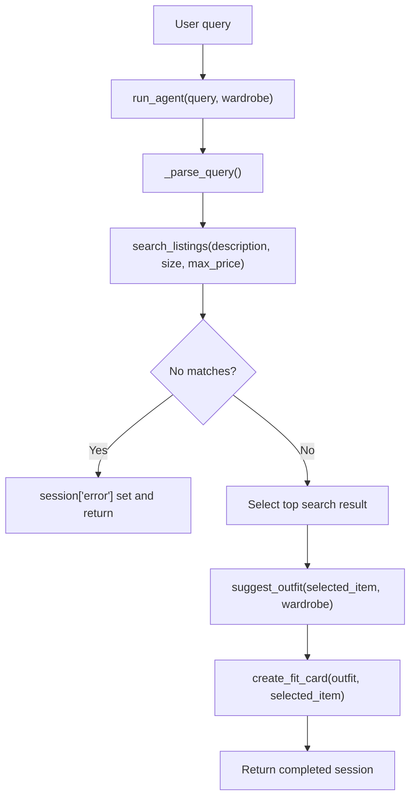

# FitFindr — Starter Kit

This starter kit contains everything you need to begin Project 2.

## What's Included

This repository contains a minimal implementation of FitFindr's planning
loop and three helper tools used to search thrift listings and generate
styling suggestions and social media captions.

```
ai201-project2-fitfindr-starter/
├── agent.py
├── tools.py
├── utils/
│   └── data_loader.py
├── data/
│   ├── listings.json
│   └── wardrobe_schema.json
├── README.md
├── requirements.txt
└── tests/
    └── test_tools.py
```

**Files of interest:**
- `tools.py`: The three main tool functions (`search_listings`,
  `suggest_outfit`, `create_fit_card`).
- `agent.py`: The planning loop that orchestrates the tools and exposes
  `run_agent(query, wardrobe)` for programmatic use.
- `utils/data_loader.py`: Data loaders for `data/listings.json` and
  `data/wardrobe_schema.json` (example and empty wardrobes).

**Quick setup**

Install dependencies and set your Groq API key in a `.env` file:

```bash
pip install -r requirements.txt
# Create a .env file in the project root containing:
# GROQ_API_KEY=your_key_here
```

**Run a quick demo**

From the project root you can run the bundled CLI examples in
`agent.py` or use a small demo script. Example one-liner (PowerShell):

```powershell
python -c "from agent import run_agent; from utils.data_loader import get_example_wardrobe; s = run_agent('vintage graphic tee under $30, size M', get_example_wardrobe()); print(s)"
```

## System workflow

The FitFindr system is an orchestrated workflow that starts with a natural
language query and ends with a fit card caption. The workflow combines a
local search over the mock listing dataset with two LLM-backed tools for
styling and caption generation.

- `run_agent(query, wardrobe)` is the entry point.
- `_parse_query()` extracts the search description, size filter, and max
  price from the user query.
- `search_listings()` searches the local dataset loaded from
  `data/listings.json`.
- If no listings match, the agent sets `session["error"]` and returns early.
- If there is a match, the top result is chosen and passed to
  `suggest_outfit()`.
- Finally, `create_fit_card()` converts the suggested outfit into a
  short social caption.



**Tool inventory**

- `search_listings(description: str, size: str | None = None, max_price: float | None = None) -> list[dict]`:
	- Inputs: `description` (search keywords), optional `size` (e.g., "M"), optional `max_price`.
	- Output: list of listing dicts sorted by relevance (highest score first).
	- Purpose: local, deterministic search over `data/listings.json` using
		token overlap scoring. Does not call any remote service.

- `suggest_outfit(new_item: dict, wardrobe: dict) -> str`:
	- Inputs: `new_item` (a single listing dict), `wardrobe` (dict with
		`items` list).
	- Output: Short string with 1–2 outfit suggestions.
	- Purpose: Uses the Groq LLM to produce styling suggestions; when the
		wardrobe is empty the function returns general styling advice.

- `create_fit_card(outfit: str, new_item: dict) -> str`:
	- Inputs: `outfit` (suggestion text), `new_item` (listing dict).
	- Output: 2–4 sentence social caption suitable for an OOTD post.
	- Purpose: Uses the Groq LLM to generate a shareable caption. Returns
		an explanatory message (not an exception) when `outfit` is empty.

**How the planning loop works (agent.py)**

1. `run_agent(query, wardrobe)` initializes a session dict capturing the
	 original query, parsed parameters, tool outputs, and any error.
2. The query is parsed by a local `_parse_query()` helper to extract a
	 cleaned `description` string, optional `size` token, and optional
	 `max_price` (only recognized when tied to a `$` or price keyword).
3. `search_listings()` is called with the parsed parameters. If no
	 results are returned, the run ends early with `session['error']` set
	 to a helpful message; the LLM-backed tools are not called with empty
	 input.
4. The top search result is selected as `session['selected_item']`.
5. `suggest_outfit()` is called with the chosen item and the supplied
	 `wardrobe`; its output is stored in `session['outfit_suggestion']`.
6. `create_fit_card()` converts the outfit suggestion into a short
	 social caption stored in `session['fit_card']`.
7. The completed `session` dict is returned.

**State management**

- The agent uses a single `session` dict as the single source of truth.
	Key fields include:
	- `query`: original user input
	- `parsed`: dict containing `description`, `size`, `max_price`
	- `search_results`: list of matching listings
	- `selected_item`: listing chosen for styling
	- `wardrobe`: the user's wardrobe passed through from caller
	- `outfit_suggestion`, `fit_card`: LLM outputs
	- `error`: if set, indicates early termination and explains why

This simple approach keeps tool inputs/outputs explicit and easy to
inspect during testing.

**Error handling strategy**

- Search no-results: `run_agent` sets `session['error']` with a helpful
	message (e.g., "I couldn't find any listings matching ...") and
	returns early; this prevents calling the LLMs with empty search
	results.
- LLM guardrails: `create_fit_card()` detects an empty or whitespace
	`outfit` and returns a friendly error string ("Couldn't generate a fit
	card — no outfit suggestion was provided...") instead of raising an
	exception. This keeps the CLI/agent stable when upstream steps produce
	edge cases.

Concrete test examples from local runs:
- Searching for `designer ballgown size XXS under $5` produces an empty
	results list; `session['error']` explains the missing results and
	suggests broadening filters.
- Calling `create_fit_card('', item)` returns the descriptive message
	rather than throwing an exception (useful for test coverage).

**Spec reflection**

- One way the spec helped: The assignment's explicit requirement that
	`search_listings` be deterministic and offline made it straightforward
	to write a token-overlap scoring mechanism and unit tests that don't
	require network access.
- One divergence: The spec allowed for different query-parsing
	strategies; I implemented a compact regex-based `_parse_query()` for
	predictable behavior rather than using an LLM to parse queries. This
	improves testability and avoids cost/latency for a simple extraction
	task.

**AI usage notes (two concrete instances)**

1. In `suggest_outfit()`: I prompt the LLM with a structured description
	 of the `new_item` plus a short, bulleted list of named wardrobe
	 pieces so the model can reference items by name. I revised the
	 system/user prompt after testing to instruct the model to keep
	 suggestions concise and to explicitly reference wardrobe piece names.

2. In `create_fit_card()`: I iterated on the prompt to require the
	 caption to mention the item name, price, and platform once each and
	 to sound like an authentic OOTD post. This came from manual review of
	 early outputs that sometimes felt like product copy; tightening the
	 prompt produced friendlier captions.

**Running tests**

Run the unit tests with:

```bash
pytest -q
```

LLM-backed tests are skipped automatically when `GROQ_API_KEY` is not
set.

